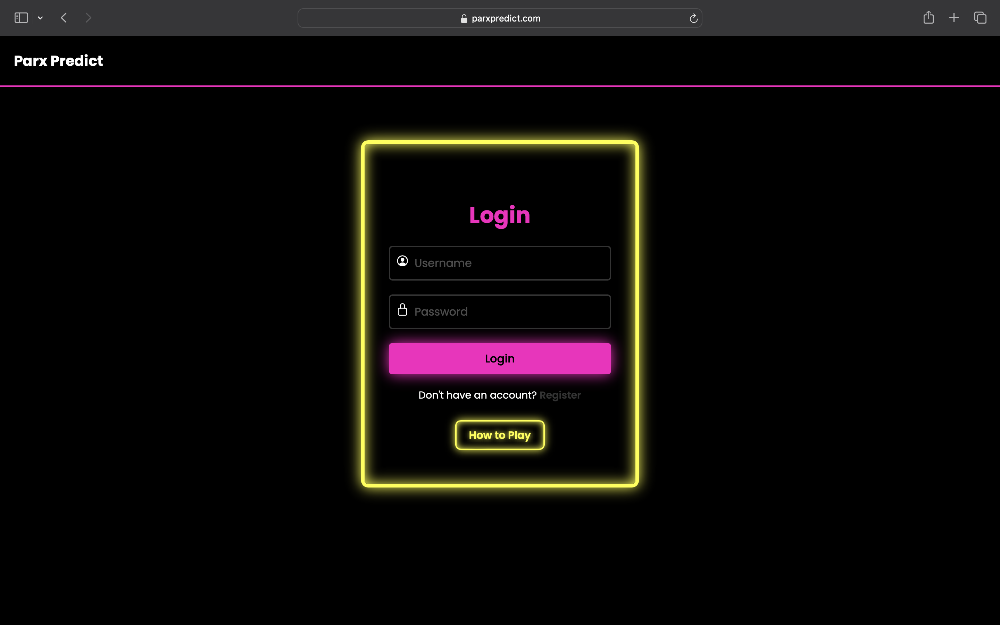
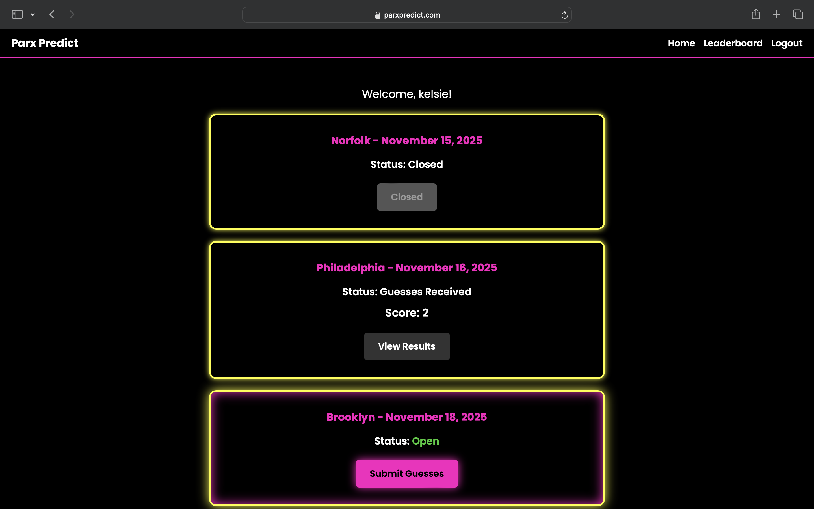
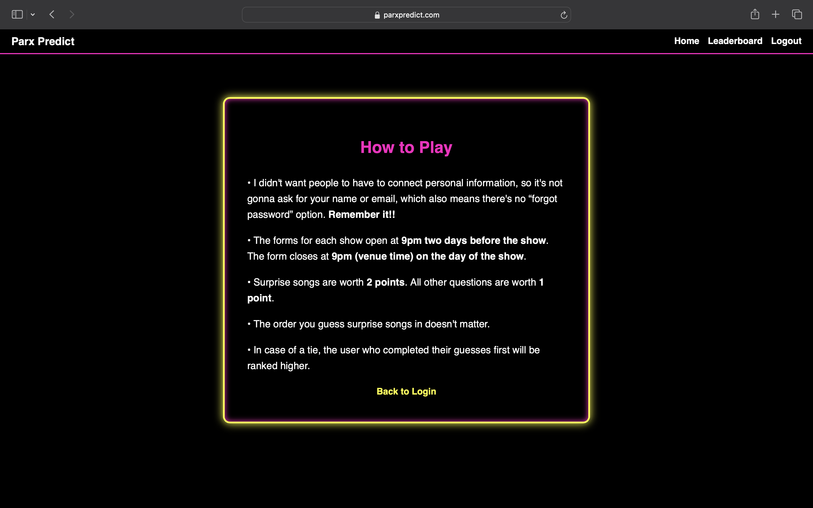
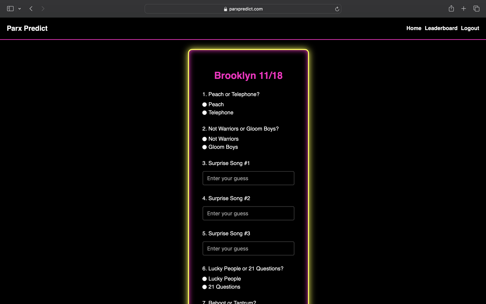
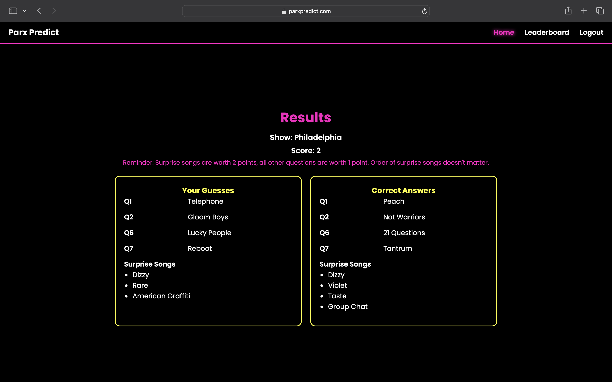
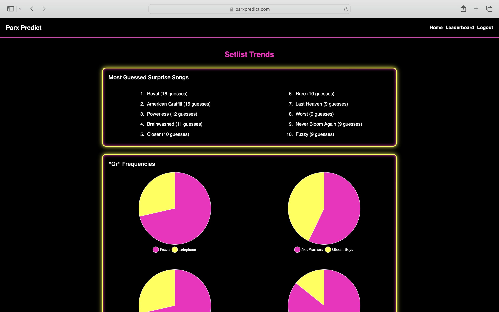
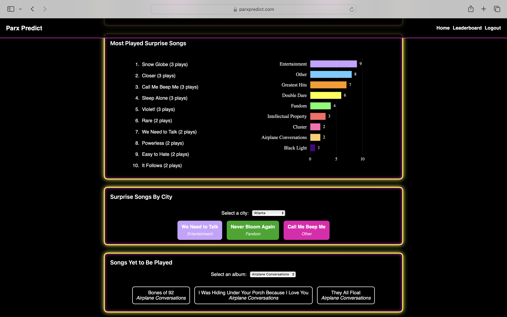

# Setlist Guessing Game Web App
An interactive full-stack web application where fans predict concert setlists, submit guesses, and compete based on accuracy. Surprise songs earn extra points, and users can view results, scores, and leaderboards after each show.

## Gameplay and Scoring
- Users predict setlists for specific tour dates using a quiz-style form
- Automatic scoring with weighted surprise song logic
- Dynamic result pages showing user guesses vs. correct setlist
- Manual score adjustments possible via Cloud SQL

## User Experience
- User registration, login, and session authentication
- Mobile-responsive design for gameplay on concert days
- Random guess generator for surprise song ideas.
- Personalized dashboard and results history
- Leaderboard displaying top-scoring participants

## Tech Stack
- Frontend: HTML, CSS, JavaScript
- Backend: Node.js, Express
- Database: PostgreSQL via Cloud SQL
- Auth: Express session, bcrypt
- Hosting: Google Cloud Run, Docker

## Screenshots
##### Login Page

##### Home Screen
 

##### How to Play

##### Submission Form

##### Results Page

#### Setlist Trends

### Current Impact
- 120+ registered users
- Supports multiple tour dates dynamically

### Future Enhancement
- Support for multiple tour legs (UK/EU dates)
- Setlist Trends in navbar, condensed navbar

### Acknowledgements
- Inspired by SwiftAlert/Mastermind for The Eras Tour
